# PII Redaction Tool

I built this tool to pseudonymise the supplied Word prospectus while retaining
its usable layout. It replaces detected values with stable, plausible fake
alternatives rather than a generic `[REDACTED]` token.

## Deliverables

| Assignment deliverable | Location |
|---|---|
| Source code | `redact.py`, `piiredact/`, `verify_delivery.py` |
| Redacted Word document | `output/Red Herring Prospectus - REDACTED.docx` |
| README | This file |
| Evaluation report | `EVALUATION.md`, `output/PII_Redaction_Evaluation_Report.docx` and current `reports/evaluation*.json` files |
| Hosted reviewer console | `web/` — static Vite site, ready for Vercel |

## Hosted reviewer console

I built `web/` as a small, read-only reviewer console. It provides a direct link to the redacted DOCX, source repository, evaluation summary and delivery-verification evidence. It is a portable static Vite site that is ready to deploy on Vercel; see [`web/README.md`](web/README.md) for the exact import settings.

It intentionally **does not accept source-document uploads**. The exact tested
pipeline runs locally, so the supplied prospectus is never transmitted to or
retained by an additional cloud service. The console contains only the
mechanically verified, committed delivery summary and needs neither a backend
nor a database.

`output/PII_Redaction_Evaluation_Report.docx` is an upload-ready rendering of
the same report. I generate it with `python build_evaluation_report.py`, so it
remains aligned with `EVALUATION.md` and contains no source values.

## Run

```bash
pip install -r requirements.txt
python -m spacy download en_core_web_sm

python redact.py --input input.docx --output "output/Red Herring Prospectus - REDACTED.docx"
python -m unittest discover tests -v
python verify_delivery.py
```

The supplied prospectus is intentionally not duplicated in the archive. To
re-run the final two commands, place the assignment's original document in the
archive root as `input.docx`. The archived test suite itself is synthetic and
does not require source PII.

## Approach

I use a hybrid pipeline:

1. Regex/context detectors handle email, phone, SSN, credit card, IP address,
   DIN, date of birth and website values.
2. spaCy NER, table-column cues and a document-wide gazetteer detect people and
   company/legal-entity names.
3. Each paragraph is flattened across Word runs before detection, then mapped
   back to those runs for replacement. This covers values split across styling,
   table cells, headers, footers and hyperlinks.
4. I scan hidden Word `HYPERLINK` field instructions separately, so a visible
   fake email cannot retain a real `mailto:` target in the DOCX XML.
5. I replace every embedded raster image with a neutral placeholder by default.
   This fail-closed policy covers text-free QR codes, scans and other image PII.

Fakes come from seeded `Faker` (`en_IN`) and are memoised. The same canonical
source value therefore receives the same fake throughout a run. I preserve
letter casing and legal-form suffixes where applicable; variants differing only
in presentation can intentionally share one stable mapping.

## Policy and trade-offs

The tool redacts people, named legal entities, emails, phones, postal
addresses, DINs and non-allowlisted websites. It deliberately retains named
regulators, statutes, exchanges and depositories. That is a policy decision,
not a statement that they are universally non-sensitive; it can be changed in
`piiredact/allowlist.py`.

The supplied text layer produced no SSN, credit-card, date-of-birth or IP
matches. Those detector/replacement paths are still exercised by the end-to-end
test suite. The image policy trades image utility for safety: `--keep-images`
is available for a known-safe document, but I did not use it for this output.

## Evidence from the current run

The final output was produced from `input.docx` with the command above. It
scanned 4,181 text blocks, made 610 visible-text replacements, redacted 77
hidden field values and neutralised 8 image parts. It created 258 stable
source-to-fake mappings.

`python verify_delivery.py` validates the serialized DOCX package—not just its
visible text. It confirms equal paragraph/table/section/block/bold-run counts
between input and output; confirms all embedded image bytes are neutral
placeholders; and confirms that no source value detected by the current
pipeline remains in output XML. It also checks that mapping, text-detection,
field-code and image audit artefacts avoid cleartext source values.

The final current score on the separate 130-block secondary annotation set is
relaxed precision **0.971**, recall **1.000**, F1 **0.986**, and character
accuracy **0.9944**. These numbers describe the saved annotations, not a proof
that no unlabelled PII remains. [EVALUATION.md](EVALUATION.md) explains the
sampling, reproducibility checks, metrics and limitations without claiming an
unverifiable blind-evaluation history.

## Audit artefacts

The output directory contains privacy-safe audit files:

| File | Contents |
|---|---|
| `mapping.csv` | Entity type, one-way source SHA-256 and fake replacement |
| `detections.jsonl` | Visible-text replacement location, detector, hash and fake |
| `field_code_redactions.json` | Hidden hyperlink-field replacement hashes and fakes |
| `media_redactions.json` | Neutralised image package parts and media types |

```mermaid
flowchart TD

subgraph group_redaction["Redaction pipeline"]
  node_cli["Redaction CLI<br/>Python entry point<br/>[redact.py]"]
  node_pipeline["Pipeline orchestration<br/>Python pipeline<br/>[pipeline.py]"]
  node_docx_io["DOCX package I/O<br/>DOCX adapter<br/>[docx_io.py]"]
  node_spans["Span-to-run mutation<br/>format-preserving editor<br/>[spans.py]"]
  node_detectors["Hybrid PII detection<br/>detection engine<br/>[detectors.py]"]
  node_spacy{{"spaCy NER model<br/>external model"}}
  node_allowlist["Public-entity allowlist<br/>policy rules<br/>[allowlist.py]"]
  node_fakes["Stable fake generator<br/>pseudonymisation<br/>[fakes.py]"]
  node_media["Media redaction policy<br/>image sanitizer<br/>[media.py]"]
end

subgraph group_delivery["Delivery evidence"]
  node_redacted_docx["Redacted DOCX<br/>delivery document"]
  node_audit["Privacy-safe audit files<br/>audit artifacts"]
  node_detections["Detection records<br/>JSONL audit<br/>[detections.jsonl]"]
  node_mapping["Hashed mapping<br/>CSV audit<br/>[mapping.csv]"]
  node_field_audit["Field-code redactions<br/>JSON audit"]
  node_verify["Delivery verification<br/>Python validator<br/>[verify_delivery.py]"]
  node_evaluate["Evaluation metrics<br/>Python evaluation<br/>[evaluate.py]"]
  node_report_builder["Evaluation report builder<br/>Python report renderer"]
  node_evaluation_json["Evaluation results<br/>persisted metrics<br/>[evaluation.json]"]
end

subgraph group_reviewer["Reviewer surface"]
  node_reviewer_entry["Reviewer app entry<br/>React/Vite entry point<br/>[main.tsx]"]
  node_reviewer_app["Read-only reviewer console<br/>React UI<br/>[App.tsx]"]
end

node_cli -->|"runs"| node_pipeline
node_pipeline -->|"reads and writes package"| node_docx_io
node_docx_io -->|"text and run structure"| node_spans
node_pipeline -->|"detects PII"| node_detectors
node_detectors -->|"NER"| node_spacy
node_detectors -->|"applies exclusions"| node_allowlist
node_detectors -->|"canonical values"| node_fakes
node_fakes -->|"replacement text"| node_spans
node_pipeline -->|"applies image policy"| node_media
node_pipeline -->|"writes"| node_redacted_docx
node_pipeline -->|"writes"| node_audit
node_audit -->|"includes"| node_detections
node_audit -->|"includes"| node_mapping
node_audit -->|"includes"| node_field_audit
node_verify -->|"validates"| node_redacted_docx
node_verify -->|"checks safety"| node_audit
node_evaluate -->|"computes"| node_evaluation_json
node_report_builder -->|"renders from"| node_evaluation_json
node_reviewer_entry -->|"boots"| node_reviewer_app
node_reviewer_app -.->|"presents committed evidence"| node_audit
node_reviewer_app -.->|"presents metrics"| node_evaluation_json

click node_cli "https://github.com/ankan00v/scalepii/blob/main/redact.py"
click node_pipeline "https://github.com/ankan00v/scalepii/blob/main/piiredact/pipeline.py"
click node_docx_io "https://github.com/ankan00v/scalepii/blob/main/piiredact/docx_io.py"
click node_spans "https://github.com/ankan00v/scalepii/blob/main/piiredact/spans.py"
click node_detectors "https://github.com/ankan00v/scalepii/blob/main/piiredact/detectors.py"
click node_allowlist "https://github.com/ankan00v/scalepii/blob/main/piiredact/allowlist.py"
click node_fakes "https://github.com/ankan00v/scalepii/blob/main/piiredact/fakes.py"
click node_media "https://github.com/ankan00v/scalepii/blob/main/piiredact/media.py"
click node_detections "https://github.com/ankan00v/scalepii/blob/main/output/detections.jsonl"
click node_mapping "https://github.com/ankan00v/scalepii/blob/main/output/mapping.csv"
click node_field_audit "https://github.com/ankan00v/scalepii/blob/main/output/field_code_redactions.json"
click node_verify "https://github.com/ankan00v/scalepii/blob/main/verify_delivery.py"
click node_evaluate "https://github.com/ankan00v/scalepii/blob/main/evaluate.py"
click node_report_builder "https://github.com/ankan00v/scalepii/blob/main/build_evaluation_report.py"
click node_evaluation_json "https://github.com/ankan00v/scalepii/blob/main/reports/evaluation.json"
click node_reviewer_entry "https://github.com/ankan00v/scalepii/blob/main/web/src/main.tsx"
click node_reviewer_app "https://github.com/ankan00v/scalepii/blob/main/web/src/App.tsx"

classDef toneNeutral fill:#f8fafc,stroke:#334155,stroke-width:1.5px,color:#0f172a
classDef toneBlue fill:#dbeafe,stroke:#2563eb,stroke-width:1.5px,color:#172554
classDef toneAmber fill:#fef3c7,stroke:#d97706,stroke-width:1.5px,color:#78350f
classDef toneMint fill:#dcfce7,stroke:#16a34a,stroke-width:1.5px,color:#14532d
classDef toneRose fill:#ffe4e6,stroke:#e11d48,stroke-width:1.5px,color:#881337
classDef toneIndigo fill:#e0e7ff,stroke:#4f46e5,stroke-width:1.5px,color:#312e81
classDef toneTeal fill:#ccfbf1,stroke:#0f766e,stroke-width:1.5px,color:#134e4a
class node_cli,node_pipeline,node_docx_io,node_spans,node_detectors,node_spacy,node_allowlist,node_fakes,node_media toneBlue
class node_redacted_docx,node_audit,node_detections,node_mapping,node_field_audit,node_verify,node_evaluate,node_report_builder,node_evaluation_json toneAmber
class node_reviewer_entry,node_reviewer_app toneMint
```



These files deliberately do not store cleartext source PII. The source
prospectus and gold annotations remain local working inputs and are not needed
to read the final redacted document.
